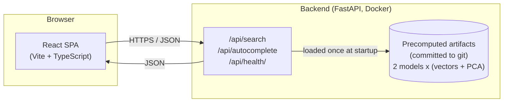
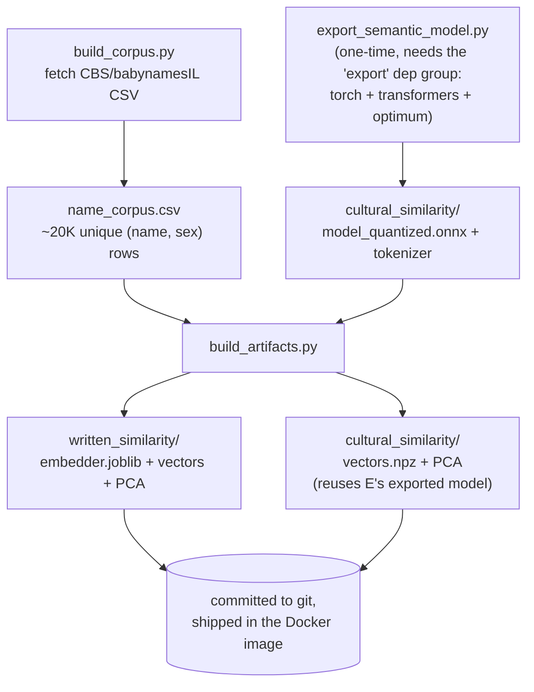
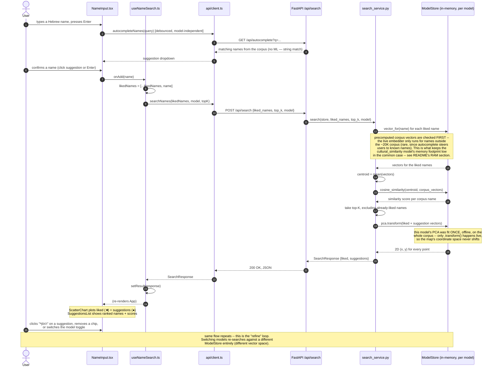

# שם לי (name-me)

A portfolio web app for choosing a Hebrew baby name with a little machine-learning help.
Enter a couple of Hebrew names you like, and the app finds similar names by embedding them
and running cosine similarity search over a corpus of ~20,000 real Hebrew given names — with
the results plotted on a 2D map so you can see how names relate to each other, then refine
by adding or removing names and re-searching. Two independent similarity models are live —
pick either one, per search — see [below](#the-two-similarity-models).

> **Status**: both models (`written_similarity` and `cultural_similarity`) are built, tested,
> and verified end-to-end, including a live UI toggle between them. Not yet deployed to a
> public URL — see [Deployment](#deployment). Full history/design in [`PLAN.md`](./PLAN.md).

## Quickstart (one-liners)

```bash
# Run everything (installs deps + creates .env files on first run, then starts both
# servers; Ctrl+C stops both cleanly) — from the repo root:
./run.sh
# → frontend at http://127.0.0.1:5173, backend at http://127.0.0.1:8000/docs
# RELOAD=1 ./run.sh restarts the backend on code changes, for active dev.
# BACKEND_PORT=... / FRONTEND_PORT=... override the default ports.

# Or run each service by hand, in two terminals:
cd backend && uv sync && cp .env.example .env && uv run uvicorn nameme.main:app --reload
cd frontend && npm install && cp .env.example .env && npm run dev

# Rebuild the ML artifacts (only needed after changing the corpus or embedder code) — from backend/
uv run python scripts/build_corpus.py               # refresh the name corpus
uv sync --group export && uv run --group export python scripts/export_semantic_model.py  # re-export the cultural model (rare)
uv run python scripts/build_artifacts.py             # (re)fit both models + their PCA projectors
# ↑ open backend/scripts/pipeline_status.html in a browser while these run for live progress

# Run all tests
cd backend && uv run pytest && uv run ruff check .
cd frontend && npm run test && npx tsc -b && npm run lint
```

## Architecture



The backend loads its ML artifacts **once at process startup** and serves most requests
entirely from memory — there is no database and no per-request model training. The frontend
is a static single-page app; it never talks to anything except this one backend API.

## Offline artifact pipeline

Everything the backend needs to answer a search is precomputed **offline** and committed to
git — the deployed app never trains or downloads anything at runtime.



All three scripts write live progress to `backend/scripts/pipeline_status.html` (self-
contained, meta-refreshing, no server needed — just open it in a browser or VS Code's
preview while a script runs) via the shared `scripts/pipeline_status.py` helper.

## Data flow: one search request, end to end

This is the core interaction, traced through every layer — from a keystroke in the browser
to the chart re-rendering.



**Why this design:** the expensive part (embedding all ~20,000 corpus names + fitting the 2D
PCA projection) happens **once, offline**, in `backend/scripts/build_artifacts.py` — not on
the request path. A live search only has to resolve the handful of names the user typed
(usually a precomputed lookup, occasionally a live encode for a genuinely new name), compute
cosine similarity against a precomputed matrix (fast, vectorized numpy), and project into the
already-fitted 2D space. This is what keeps `/api/search` fast and keeps each model's scatter
plot coordinate system stable as you refine your search within a session.

## The two similarity models

- **`written_similarity`**: character n-gram TF-IDF → SVD. Captures pure *spelling*
  similarity — "דוד" and "דודי" are close because they share substrings. No training data
  beyond the name list itself; generalizes to names it's never seen. ~100-dim vectors.
- **`cultural_similarity`**: a pretrained multilingual sentence-transformer
  (`paraphrase-multilingual-MiniLM-L12-v2`, exported to ONNX + int8-quantized) embedding of
  the bare Hebrew name string, aiming to surface names that are culturally/biblically related
  even when spelled completely differently. 384-dim vectors. This is an explicitly
  **experimental** technique — there's no confirmed prior art for it and no ground-truth
  dataset to validate against. The sanity check run during `build_artifacts.py` is
  encouraging: e.g. searching "דוד" (David) surfaces "יוהונתן" (Jonathan — David's biblical
  companion) and "גדעון" (Gideon, a biblical judge) rather than just spelling-similar
  compound names — but treat it as a soft, human-judged signal, not a guarantee (see
  `PLAN.md`'s "Sanity check" section for the full methodology and numbers).

Both models implement the same `NameEmbedder` interface (`backend/src/nameme/embedding/`)
and are served **simultaneously** — the frontend's model toggle picks which one a given
search uses, no redeploy needed. Adding a third technique later means writing one new class
and registering it in `embedding/registry.py` — no API contract changes.

## Memory footprint (why this matters for free-tier hosting)

`cultural_similarity`'s ONNX session + tokenizer cost real memory to load — and surprisingly,
**the tokenizer (~210MB, XLM-R's 250K-token multilingual vocab) costs more than the 118MB
quantized model itself**. To keep this affordable on a free-tier host, loading is lazy and
corpus-vector lookups happen first (see the sequence diagram above):

| Scenario | Measured RSS |
|---|---|
| Idle, right after startup (both models' precomputed vectors loaded, ONNX session not yet touched) | **~250 MB** |
| After searching with names already in the corpus (the common case, since autocomplete guides input) | **~260 MB** |
| After the *first* search with a name genuinely outside the corpus under `cultural_similarity` (triggers the one-time lazy load) | **~700 MB**, for the remaining lifetime of that process |

The typical case comfortably fits a ~512MB free tier; the worst case (a truly novel name
under `cultural_similarity`) does not. This is a known, accepted trade-off — see `PLAN.md`'s
"RAM verification" section for the full measurement methodology and fallback options if it
becomes a real problem in practice.

## Project layout

```
backend/    FastAPI service serving the embedding/search/autocomplete API
frontend/   React + TypeScript + Vite single-page app
PLAN.md     Living implementation plan (Phase 1 = MVP, Phase 2 = second model — both done)
```

See `backend/README.md` and `frontend/README.md` for per-service details.

## Testing

```bash
cd backend && uv run pytest && uv run ruff check .
cd frontend && npm run test && npm run lint && npx tsc -b
```

## Deployment

- **Backend**: Docker image (`backend/Dockerfile`), designed for a free-tier host like
  [Render](https://render.com) as a web service. Set `CORS_ORIGINS` to your deployed
  frontend URL. The `export` dependency group (torch/transformers/optimum) is never
  installed in the image — only `onnxruntime` + `tokenizers` are runtime deps.
- **Frontend**: static Vite build, designed for a free-tier host like
  [Vercel](https://vercel.com). Set `VITE_API_BASE_URL` to your deployed backend URL.

**Known trade-offs**: (1) free-tier backend hosts typically spin down after a period of
inactivity, so the first request after a while can take 30–60s to wake the server back up —
the frontend shows a "waking up..." message during this window. (2) See the memory footprint
table above — a free tier around 512MB fits the typical case but not the `cultural_similarity`
worst case.

**Not yet deployed** — the app is deployment-ready but hasn't been pushed to Render/Vercel
yet (needs account access). Docker build itself is also unverified (no Docker daemon
available in the sandbox this was built in) — worth a test build before deploying.

## License

Code is MIT-licensed (see [`LICENSE`](./LICENSE)). The name corpus has separate provenance
and licensing — see [`DATA_SOURCE.md`](./DATA_SOURCE.md).
