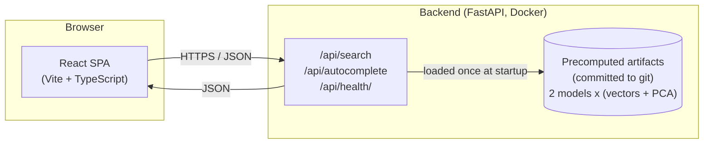
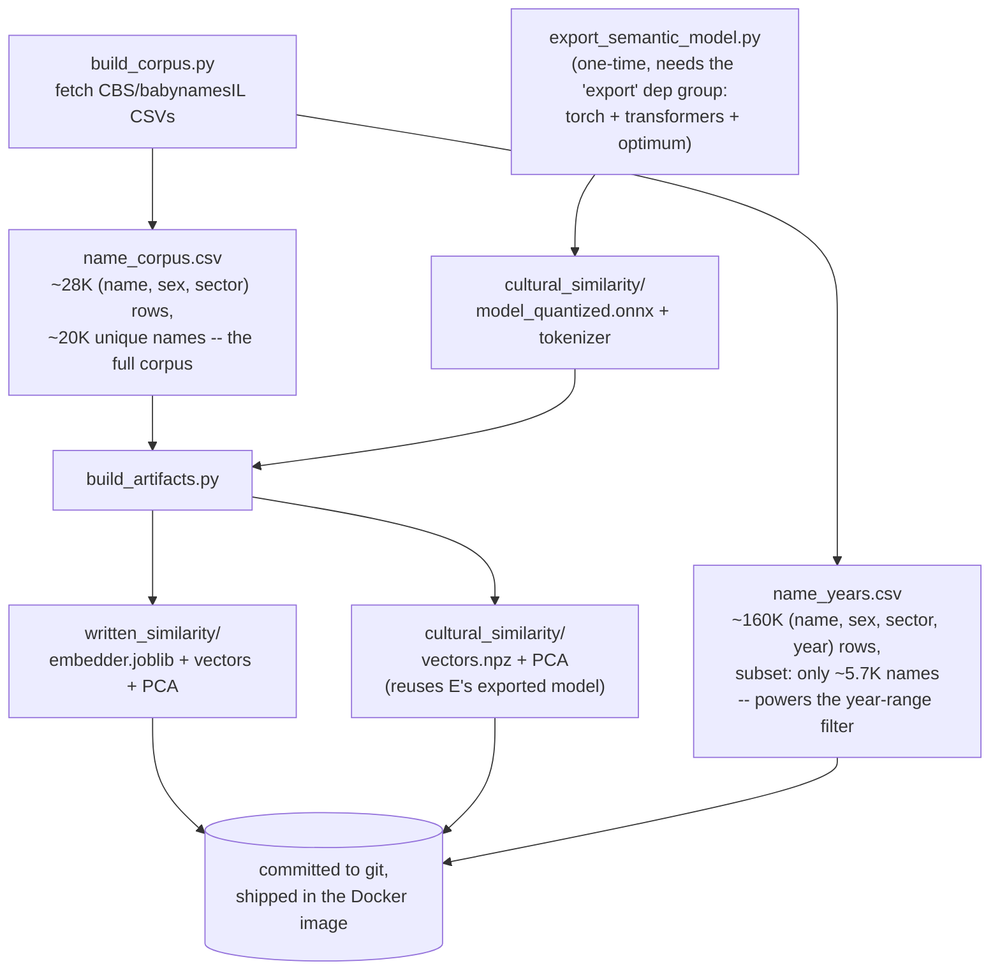
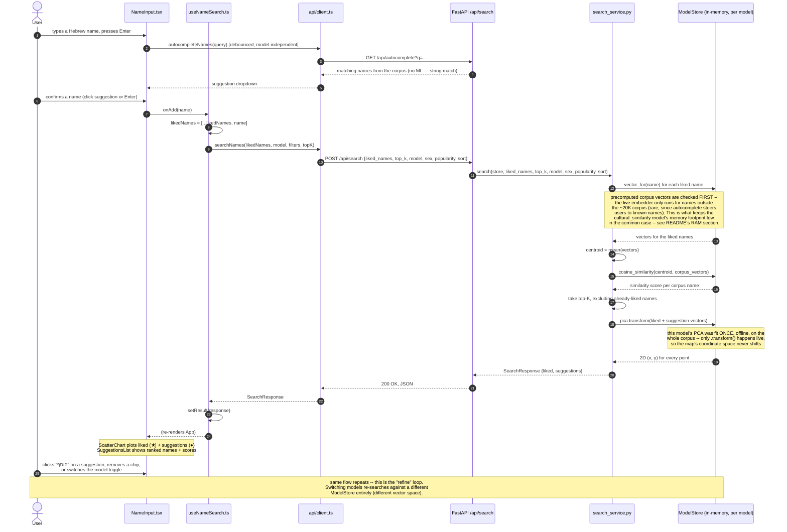
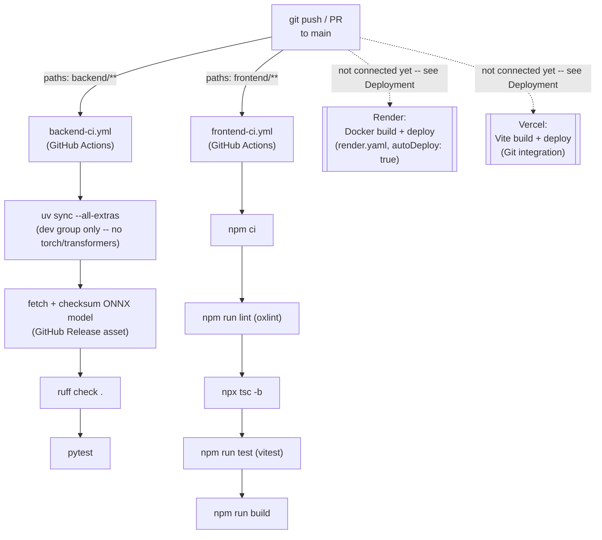

# שם לי (name-me)

A web app for choosing a Hebrew baby name with a little machine-learning help.
Enter a couple of Hebrew names you like, and the app finds the 20 closest names to their
"middle point" by embedding them and running cosine similarity search over a corpus of
~20,000 real Hebrew given names — with the results plotted on a 2D map so you can see how
names relate to each other, then refine by adding/removing names, filtering by sex,
population sector, birth-year range (a "ruler"), or popularity, or flipping to "most
different" instead of "most similar." Two independent similarity models are live — pick
either one, per search — see [below](#the-two-similarity-models).

> **Status**: both models (`written_similarity` and `cultural_similarity`) are built, tested,
> and verified end-to-end, including a live UI toggle between them. Not yet deployed to a
> public URL — see [Deployment](#deployment). Full history/design in [`PLAN.md`](./PLAN.md).

## Quickstart (one-liners)

```bash
# Run everything (installs deps + creates .env files on first run, then starts both
# servers; Ctrl+C stops both cleanly) — from the repo root:
./run.sh
# → frontend at http://127.0.0.1:5173, backend at http://127.0.0.1:8000/docs
# RELOAD=1 ./run.sh restarts the backend on code changes, for active dev.
# BACKEND_PORT=... / FRONTEND_PORT=... override the default ports.

# Or run each service by hand, in two terminals:
cd backend && uv sync && cp .env.example .env && uv run uvicorn nameme.main:app --reload
cd frontend && npm install && cp .env.example .env && npm run dev

# Rebuild the ML artifacts (only needed after changing the corpus or embedder code) — from backend/
uv run python scripts/build_corpus.py               # refresh the name corpus
uv sync --group export && uv run --group export python scripts/export_semantic_model.py  # re-export the cultural model (rare)
uv run python scripts/build_artifacts.py             # (re)fit both models + their PCA projectors
# ↑ open backend/scripts/pipeline_status.html in a browser while these run for live progress

# Run all tests
cd backend && uv run pytest && uv run ruff check .
cd frontend && npm run test && npx tsc -b && npm run lint
```

## Architecture



The backend loads its ML artifacts **once at process startup** and serves most requests
entirely from memory — there is no database and no per-request model training. The frontend
is a static single-page app; it never talks to anything except this one backend API.

## Offline artifact pipeline

Everything the backend needs to answer a search is precomputed **offline** and committed to
git — the deployed app never trains or downloads anything at runtime.



All three scripts write live progress to `backend/scripts/pipeline_status.html` (self-
contained, meta-refreshing, no server needed — just open it in a browser or VS Code's
preview while a script runs) via the shared `scripts/pipeline_status.py` helper.

## Data flow: one search request, end to end

This is the core interaction, traced through every layer — from a keystroke in the browser
to the chart re-rendering.



**Why this design:** the expensive part (embedding all ~20,000 corpus names + fitting the 2D
PCA projection) happens **once, offline**, in `backend/scripts/build_artifacts.py` — not on
the request path. A live search only has to resolve the handful of names the user typed
(usually a precomputed lookup, occasionally a live encode for a genuinely new name), compute
cosine similarity against a precomputed matrix (fast, vectorized numpy), and project into the
already-fitted 2D space. This is what keeps `/api/search` fast and keeps each model's scatter
plot coordinate system stable as you refine your search within a session.

## Search options

Every search takes the liked names' centroid ("middle point") and finds the 20 closest (or,
in "most different" mode, farthest) corpus names to it — configurable via:

- **Model**: `written_similarity` or `cultural_similarity` (see below).
- **Sex**: all / boys only / girls only. A name that's mostly given to one sex but also has
  real usage on the other (e.g. "דניאל" — heavily boys, but ~13K girls too) still shows up
  under either filter, but its *displayed* sex, popularity, and sectors are recomputed from
  only the rows matching the active filter — so a girls-only search always shows it as a
  girl's name with a girl's-only popularity count, never as a "boy" on the chart. See
  `CorpusStore.sex_sector_filtered_meta`/`year_filtered_meta` in `backend/src/nameme/corpus/loader.py`.
- **Sector**: all / Jewish / Muslim / Christian-Arab / Druze — the population-group
  breakdown CBS publishes given-name counts by (the "tabs" in the source release; see
  `DATA_SOURCE.md`). Sex and sector combine into one check, not two independent ones — e.g.
  sex=boys + sector=Jewish only matches names actually used as Jewish boys' names, not any
  name with *some* Jewish presence and *some* boys' presence from unrelated rows.
- **Birth-year range** (a "ruler" — dual-handle slider): restricts suggestions to names with
  evidence of use within the chosen year span, e.g. 1990–2010. Powered by a separate,
  supplementary yearly breakdown (`name_years.csv`) that only covers ~5,700 of the ~20,000
  corpus names (see `DATA_SOURCE.md` for why) — a name with no yearly data stays fully
  searchable with the full range selected, but drops out once you narrow the range, since
  there's no evidence of which years it was actually given in. Computed once per request
  (not per candidate) by filtering the year breakdown and re-aggregating. Dragging a handle
  updates the label/fill instantly, but the actual search fires debounced (300ms after the
  last move) — firing a search (and disabling the input while it's in flight) on every
  single one-year step used to drop the browser's mouse capture mid-drag, making the slider
  only ever movable one year at a time; see `frontend/src/components/YearRangeSlider.tsx`.
- **Popularity**: all names / top 10% most popular / top 90% (excludes only the least
  popular decile) — computed once at startup (or once per request, for a year- or
  sex/sector-filtered search) as a percentile rank, so filtering is a threshold check, not a
  re-rank.
- **Sort**: most similar (default) or most different — same ranking, walked from the other
  end, useful for finding names that deliberately *don't* resemble your liked names.

The scatter plot colors suggestions by sex (blue/pink) and sizes each point by real-world
popularity (a Recharts `ZAxis` bubble channel), with a legend and a richer tooltip (name,
similarity, sex, popularity). **Liked (selected) names render as large black stars, each
inside a soft grey halo ring, with their name printed above them** — deliberately not tied
to the popularity size scale, so they never blend into the suggestion bubbles around them.
The footer links to three places: the full name list (`/names.csv`, a static copy of the
corpus), the upstream `babynamesIL` data-source repo (see `DATA_SOURCE.md`), and — via
`VITE_GITHUB_URL`, defaulted in `frontend/.env.example` to this project's real repo — the
source code on GitHub.

## The two similarity models

- **`written_similarity`**: character n-gram TF-IDF → SVD. Captures pure *spelling*
  similarity — "דוד" and "דודי" are close because they share substrings. The vectorizer's
  vocabulary/IDF weighting is fit against a ~130K-word general Hebrew corpus (not just the
  20K names — see `DATA_SOURCE.md`), so substring rarity reflects real Hebrew usage rather
  than the biased sample of spellings that happen to be given names; the dimensionality
  reduction (SVD) still fits on the names themselves. No training data download beyond that
  background corpus fetch; generalizes to names it's never seen. ~100-dim vectors.
- **`cultural_similarity`**: a pretrained multilingual sentence-transformer
  (`paraphrase-multilingual-MiniLM-L12-v2`, exported to ONNX + int8-quantized) embedding of
  the bare Hebrew name string, aiming to surface names that are culturally/biblically related
  even when spelled completely differently. 384-dim vectors. This is an explicitly
  **experimental** technique — there's no confirmed prior art for it and no ground-truth
  dataset to validate against. The sanity check run during `build_artifacts.py` is
  encouraging: e.g. searching "דוד" (David) surfaces "יוהונתן" (Jonathan — David's biblical
  companion) and "גדעון" (Gideon, a biblical judge) rather than just spelling-similar
  compound names — but treat it as a soft, human-judged signal, not a guarantee (see
  `PLAN.md`'s "Sanity check" section for the full methodology and numbers).

Both models implement the same `NameEmbedder` interface (`backend/src/nameme/embedding/`)
and are served **simultaneously** — the frontend's model toggle picks which one a given
search uses, no redeploy needed. Adding a third technique later means writing one new class
and registering it in `embedding/registry.py` — no API contract changes.

## Memory footprint (why this matters for free-tier hosting)

`cultural_similarity`'s ONNX session + tokenizer cost real memory to load — and surprisingly,
**the tokenizer (~210MB, XLM-R's 250K-token multilingual vocab) costs more than the 118MB
quantized model itself**. To keep this affordable on a free-tier host, loading is lazy and
corpus-vector lookups happen first (see the sequence diagram above):

| Scenario | Measured RSS |
|---|---|
| Idle, right after startup (both models' precomputed vectors loaded, ONNX session not yet touched) | **~250 MB** |
| After searching with names already in the corpus (the common case, since autocomplete guides input) | **~260 MB** |
| After the *first* search with a name genuinely outside the corpus under `cultural_similarity` (triggers the one-time lazy load) | **~700 MB**, for the remaining lifetime of that process |

The typical case comfortably fits a ~512MB free tier; the worst case (a truly novel name
under `cultural_similarity`) does not. This is a known, accepted trade-off — see `PLAN.md`'s
"RAM verification" section for the full measurement methodology and fallback options if it
becomes a real problem in practice.

## Project layout

```
backend/              FastAPI service serving the embedding/search/autocomplete API
backend/notebooks/    Manual ML sanity-check Jupyter notebook (real code, real artifacts)
frontend/             React + TypeScript + Vite single-page app
scripts/              Repo-level scripts (currently: post-deploy verification)
PLAN.md               Living implementation plan (build phases 1-7 -- all done so far)
DEPLOYMENT_PLAN.md    Step-by-step plan for the (not-yet-executed) Render + Vercel deploy
render.yaml           Render Blueprint for the backend service (see DEPLOYMENT_PLAN.md)
```

See `backend/README.md` and `frontend/README.md` for per-service details.

## Testing

```bash
cd backend && uv run pytest && uv run ruff check .
cd frontend && npm run test && npm run lint && npx tsc -b
```

## CI/CD

**CI (automated testing) is live today.** **CD (automated deployment) is wired but
dormant** — it activates the moment the backend/frontend are actually connected to
Render/Vercel (see [Deployment](#deployment) below), with no extra setup needed at that
point. The two pieces are **not sequenced together yet** — see "The gap" below.



### CI: `.github/workflows/{backend,frontend}-ci.yml`

Two independent workflows, split by service and **path-filtered** so each only runs when
its own half of the repo actually changed (a frontend-only PR doesn't spin up a Python job,
and vice versa) — both trigger on every push to `main` and every pull request:

- **`backend-ci.yml`**: `uv sync --all-extras` (installs the default + `dev` dependency
  group only — `--all-extras` refers to `[project.optional-dependencies]`, which this
  project doesn't use; the heavy `export`/`notebook` groups live under `[dependency-groups]`
  and are never pulled in here), then fetches `cultural_similarity`'s ONNX model from its
  GitHub Release (see below), then `ruff check .`, then `pytest`.
- **`frontend-ci.yml`**: `npm ci`, then lint (`oxlint`), typecheck (`tsc -b`), unit tests
  (`vitest`), and a production build — the same four checks this README's
  [Testing](#testing) section runs locally, in the same order, so "CI is green" and "I ran
  the local one-liner" mean the same thing.

**Resolved gap** (was: CI failed 5 tests, not just a deploy-time concern): `cultural_similarity/model_quantized.onnx`
(~112MB) is over GitHub's 100MB git blob limit, so it isn't committed — it's hosted as a
[GitHub Release asset](https://github.com/oregev11/name-me/releases/tag/cultural-similarity-onnx-v1)
instead, and `backend-ci.yml` downloads + checksum-verifies it (`sha256sum -c`) before
running `pytest`, the same way `backend/Dockerfile` does for the deployed image (see
[Deployment](#deployment)/`DEPLOYMENT_PLAN.md`). Discovering this also surfaced that the
repo itself was private — which independently would have 404'd the footer's GitHub link for
real visitors — so the repo was made public, which also means the Release asset needs no
auth to fetch from either CI or Render's Docker build.

### CD: Render + Vercel's own Git integration — no custom pipeline needed

Neither platform needs a hand-written deploy workflow: `render.yaml` (repo root) has
`autoDeploy: true`, and Vercel's GitHub integration auto-deploys on every push by default.
Once `DEPLOYMENT_PLAN.md`'s Step 1/2 are done (connecting each platform to this repo), every
push to `main` triggers both a GitHub Actions test run **and**, independently, a Render/Vercel
rebuild-and-deploy — no secrets, deploy hooks, or extra YAML required to get *a* CD loop
running.

### The gap: CI and CD are two independent reactions to the same push, not one pipeline

Today (once connected) both fire in parallel off the same `git push` — a red test run
would **not** block a deploy, since Render/Vercel don't know or care what GitHub Actions
reported. Two ways to close that, in order of recommendation for a solo-dev project on free
tiers:

1. **Branch protection** (recommended, no extra YAML): require `backend-ci`/`frontend-ci` as
   passing status checks before a PR can merge into `main`. Since both platforms only deploy
   from `main`, this means anything actually reachable to deploy was already tested. Doesn't
   protect a direct push to `main` (no PR) — acceptable for how this repo is used today.
2. **Actions-driven deploy**: turn off `autoDeploy`, add a `deploy` job to each CI workflow
   gated on the test job succeeding, and call Render's deploy-hook URL / the Vercel CLI with
   a token stored as a GitHub secret. A real "tests must pass, *then* deploy" pipeline, at
   the cost of managing deploy-hook secrets and losing each platform's own deploy-preview UI.

Neither is implemented yet — this section documents the design, not a finished pipeline.

## Manual ML sanity check

`backend/notebooks/ml_sanity_check.ipynb` loads the real `nameme` package and real
committed model artifacts — no reimplemented logic — so you can manually compare name
pairs, run full filtered searches, and eyeball results on a 2D map:

```bash
cd backend
uv sync --group notebook
uv run jupyter lab notebooks/
```

See `backend/notebooks/README.md` for what's in it.

## Deployment

See [CI/CD](#cicd) for how testing and deployment relate to each other in this repo.

- **Backend**: Docker image (`backend/Dockerfile`), designed for a free-tier host like
  [Render](https://render.com) as a web service. Set `CORS_ORIGINS` to your deployed
  frontend URL. The `export` dependency group (torch/transformers/optimum) is never
  installed in the image — only `onnxruntime` + `tokenizers` are runtime deps.
- **Frontend**: static Vite build, designed for a free-tier host like
  [Vercel](https://vercel.com). Set `VITE_API_BASE_URL` to your deployed backend URL.

**Known trade-offs**: (1) free-tier backend hosts typically spin down after a period of
inactivity, so the first request after a while can take 30–60s to wake the server back up —
the frontend shows a "waking up..." message during this window. (2) See the memory footprint
table above — a free tier around 512MB fits the typical case but not the `cultural_similarity`
worst case.

```bash
# Build + run the production Docker image locally and smoke-test it (from repo root)
./backend/scripts/docker_smoke_test.sh

# After deploying (see DEPLOYMENT_PLAN.md), verify the live URLs end to end
BACKEND_URL=https://<render-url> FRONTEND_URL=https://<vercel-url> ./scripts/verify_deployment.sh
```

**Not yet deployed** — the app is deployment-ready: the Docker build is verified end to end
(builds, runs, serves real traffic at ~230MB idle, and — as of this session — the
`cultural_similarity` live-encode path works too, ONNX model included via a GitHub Release
asset, see `DEPLOYMENT_PLAN.md`) but hasn't been pushed to Render/Vercel yet, since that
needs a human clicking through each platform's account/OAuth setup. **`DEPLOYMENT_PLAN.md`
has the full step-by-step plan** for that part.


## Future plans
1. Sequence CI and CD together (branch protection or Actions-driven deploy — see
   [CI/CD](#cicd)), and fix the ONNX-file gap that currently makes `backend-ci` unreliable.
2. Add another embedding model, once one of the two above lands, so it ships through a CI
   gate rather than a manual local test run.

## License

Code is MIT-licensed (see [`LICENSE`](./LICENSE)). The name corpus has separate provenance
and licensing — see [`DATA_SOURCE.md`](./DATA_SOURCE.md).
